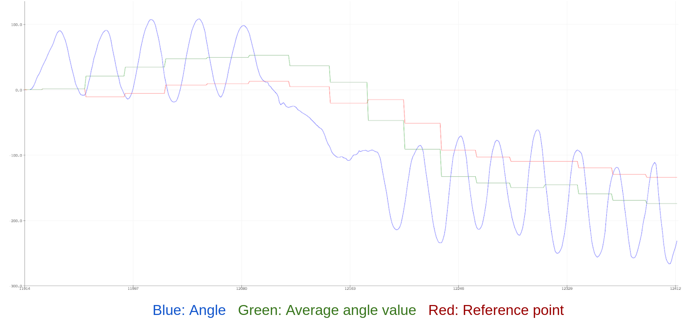
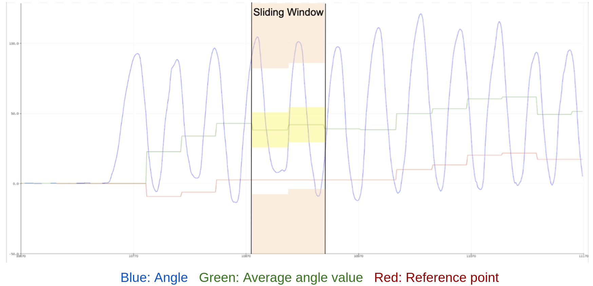
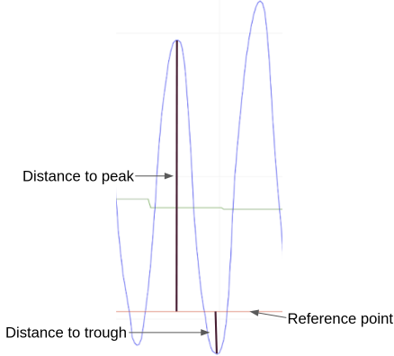

# Reps Counter Algorithm

### Current Angle

* The angular rate can be derived from gyroscope data by unit conversion.
* Integration of angular rate is current angle; 

### Reference Point
* To solve the drifting problem, maintain a reference point that drift together with the sensor readings;
* Reference point is updated base on the average value of a sliding window.

### Checking for Reps
* Current angle will then be used to compare to a reference point to check for peak and trough.
* A rep will be incremented if a peak and a trough is detected (i.e. after a peak is detected, a rep is counted if a trough is also detected within a time limit).

### Direction
Direction of movement can be obtained based on observing the acceleration value in the z-axis. 
